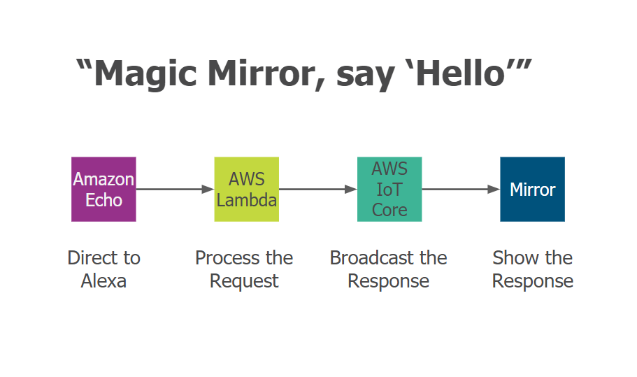
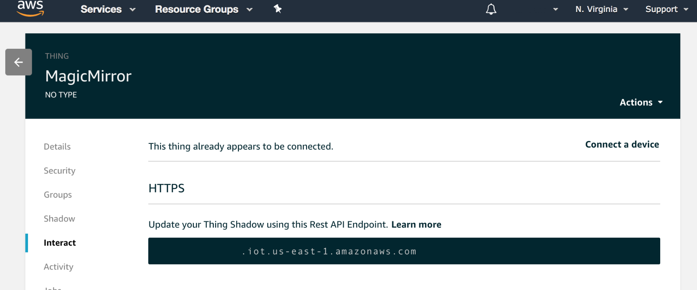

# Mirror Mirror On The Wall

> ### Build your own voice-controlled Magic Mirror Instructions



<p align="left">
	<a href="https://david-dm.org/joanaz/MirrorMirrorOnTheWallSkill"></a>
	<a href="https://david-dm.org/joanaz/MirrorMirrorOnTheWallSkill#info=devDependencies"></a>
	<a href="http://choosealicense.com/licenses/mit"></a>
</p>

## Table of Contents

- [Prerequisites](https://github.com/joanaz/MirrorMirrorOnTheWallSkill/tree/gh-pages#prerequisites)
- [Magic Mirror](https://github.com/joanaz/MirrorMirrorOnTheWallSkill/tree/gh-pages#magic-mirror)
  - [Installation](https://github.com/joanaz/MirrorMirrorOnTheWallSkill/tree/gh-pages#installation)
- [AWS IoT Core](https://github.com/joanaz/MirrorMirrorOnTheWallSkill/tree/gh-pages#aws-iot-core)
- [Alexa Skill](https://github.com/joanaz/MirrorMirrorOnTheWallSkill/tree/gh-pages#alexa-skill)
  - [Configuration](https://github.com/joanaz/MirrorMirrorOnTheWallSkill/tree/gh-pages#configuration)
- [AWS Lambda](https://github.com/joanaz/MirrorMirrorOnTheWallSkill/tree/gh-pages#aws-lambda)
  - [Get Lambda function code ready](https://github.com/joanaz/MirrorMirrorOnTheWallSkill/tree/gh-pages#get-lambda-function-code-ready)
  - [Deploy to AWS Lambda](https://github.com/joanaz/MirrorMirrorOnTheWallSkill/tree/gh-pages#deploy-to-aws-lambda)
  - [Test](https://github.com/joanaz/MirrorMirrorOnTheWallSkill/tree/gh-pages#test)
- [Magic Mirror Module](https://github.com/joanaz/MirrorMirrorOnTheWallSkill/tree/gh-pages#magic-mirror-module)
- [Have Fun!](https://github.com/joanaz/MirrorMirrorOnTheWallSkill/tree/gh-pages#have-fun)
  - [Display text](https://github.com/joanaz/MirrorMirrorOnTheWallSkill/tree/gh-pages#display-text)
  - [Turn on/off Magic Mirror Modules](https://github.com/joanaz/MirrorMirrorOnTheWallSkill/tree/gh-pages#turn-onoff-magic-mirror-modules)
  - [Display images](https://github.com/joanaz/MirrorMirrorOnTheWallSkill/tree/gh-pages#display-images)
  - [Display video](https://github.com/joanaz/MirrorMirrorOnTheWallSkill/tree/gh-pages#display-video)

## Prerequisites

- [Amazon AWS developer account](https://aws.amazon.com/free/)
- [Alexa Skills developer account](https://developer.amazon.com/alexa-skills-kit)
- Install [Node.js v10.x](https://nodejs.org/en/)
- *Install [Git](https://git-scm.com/downloads)

*__Windows users__: 
You must have a Linux Bash Shell to do this Workshop. When you are installing Git, please follow these [instructions](https://learn.adafruit.com/windows-tools-for-the-electrical-engineer/git-plus-command-line-tools) to use the Unix tools from the Windows Command Prompt.


## Magic Mirror

> ### repo: [MagicMirror](https://github.com/MichMich/MagicMirror)

We are using an open source [MagicMirror²](https://github.com/MichMich/MagicMirror) software platform that will allow you to convert your hallway or bathroom mirror into your personal assistant.

To toggle the (web) Developer Tools from mirror mode, use `CTRL-SHIFT-I` or `ALT` and select `View`.

### Installation

1. Open your command line

1. Download the repository to your laptop

	`git clone https://github.com/MichMich/MagicMirror.git`

1. Enter the repository

	`cd MagicMirror/`

1. Install node libraries

	`npm install`

1. Navigate to the config folder and rename config.js.sample to config.js

	`cd config/`

	`mv config.js.sample config.js`

1. Run the app

	`npm start`


## AWS IoT Core

We need to setup an AWS IoT Device Gateway. It works as a hub that will allow an Alexa Skill to send messages to it and a Magic Mirror to subscribe to new messages from it. This will let us control our Magic Mirror with our voice. 
 
1. Login to __[AWS Management Console](https://console.aws.amazon.com/console/home?region=us-east-1)__
	

1. Choose __US East (N. Virginia)__ region
	

1. Find __IoT Core__ service
  

1. Click on __Onboard__ at the left menu bar, under _Configuring a device_, click on __Get Started__
  

1. Click on __Get Started__
  

1. Choose __Linux/OSX__ platform, and __Node.js__
  

1. Name your device __MagicMirror__
  

1. Download credentials, aka connection kit
  

1. Click on __Next step__
  

1. Follow the instructions to run the start.sh script, which will generate a root-CA.crt
  	
  	
  	
  	
  	
  	- _Note: Don’t worry about errors as long as you get a root-CA.crt file_
  	- _Note note: You will need to copy the credential files here for Lambda function deployment later_

1. Go back to the AWS web page, click on Done

1. Open the __MagicMirror__ Thing you just created
  
1. Click on __Interact__ on the left menu bar, see the __HTTPS Rest API Endpoint__ in the format of `xxxxxxxxxxxxxxx.iot.us-east-1.amazonaws.com`? You will need to copy this endpoint for Lambda function deployment later
  
  

## Alexa Skill

In this section, we build the language model for our Alexa Skill by defining the commands that Alexa can recognize.

### Configuration

1. Go to the [Alexa Developer Console](https://developer.amazon.com/alexa/console/ask)

1. Click on the __Create Skill__ button.
  

1. Name your Skill (any name is fine), select __Custom__ model, and click the __Create a skill__ button.
  
  
1. Choose __Start from scratch__ template

1. Click on __Invocation__ on the left menu bar. Set “magic mirror” as the invocation name (or any unique phrase). This is the phrase used to activate your skill. __Save Model__.
  

1. Click on __JSON Editor__ on the left menu bar. Delete everything in there. 

1. Go to [__InteractionModel.json__](https://github.com/joanaz/MirrorMirrorOnTheWallSkill/blob/master/speechAssets/InteractionModel.json) in the speechAssets folder, and copy everything in the file, and paste it in JSON Editor. __Save Model__. __Build Model__
  

1. Click on __Endpoint__ on the left menu bar. Select __AWS Lambda ARN__. Copy your __Skill ID__ to be used later in Lambda function deployment
  


## AWS Lambda

> ### repo: https://github.com/joanaz/MirrorMirrorOnTheWallSkill

In this section, we deploy our AWS Lambda function for our Alexa skill. Our Lambda function processes our voice commands and tells Alexa how to respond, and sends our commands to the AWS IoT Device Gateway.

### Get Lambda function code ready

1. Download the GitHub repository to your laptop
 
	`git clone https://github.com/joanaz/MirrorMirrorOnTheWallSkill.git`

1. Install node libraries
 
	`cd MirrorMirrorOnTheWallSkill/src/`
 
	`npm install`

1. Navigate to the certs folder and rename keys_sample.json to keys.json
 
	`cd certs/`
 
	`mv keys_sample.json keys.json`

1. Copy the credential files generated in [Section AWS IoT](???). Then open the local MirrorMirrorOnTheWallSkill folder you downloaded, go to src, then certs, paste your credential files here
	

1. Open MirrorMirror.js in src folder with a text editor. Copy and paste your __HTTPS Rest API Endpoint__ to line 17, replacing `YOURID.iot.us-east-1.amazonaws.com`
	

1. Open index.js in src folder with a text editor. Copy and paste your __Alexa Skill ID__ to line 18 for the variable __APP_ID__, replacing `amzn1.ask.skill.YOURALEXASKILLID`, and save the change
	

  
#### Dependencies

Here’s the list of node libraries you installed in the above step. If you are interested in learning more about them, you can go and check out their links.

- [alexa-sdk](https://github.com/alexa/alexa-skills-kit-sdk-for-nodejs) 

- [aws-iot-device-sdk](https://github.com/aws/aws-iot-device-sdk-js) 

- [Google Images Search](https://www.npmjs.com/package/google-images)

	OPTIONAL: It is for showing images on the Magic Mirror. Follow the instructions in the link to create your own Google Custom Search Engine, and save the CSE ID and API key in __certs/keys.json__ (see keys.json below).
	
- [Youtube API](https://www.npmjs.com/package/youtube-node). 

	OPTIONAL: It is for showing a video on the Magic Mirror. Watch this [instruction video](https://youtu.be/Im69kzhpR3I) to create your own Youtube API key, and save it in __certs/keys.json__ (see keys.json below).

#### keys.json

The keys.json file is where you put your Google Images Search and YouTube API keys. 

```javascript
// keys.json
{
    "cse": {
        "ID": "YOUR GOOGLE CUSTOM SEARCH ENGINE ID",
        "API_key": "YOUR GOOGLE PROJECT API KEY"
    },
    "youtube": {
        "API_key": "YOUR YOUTUBE API KEY"
    }
}
```

### Deploy to AWS Lambda 

1. Go inside your local __src__ directory, select all files and folders, then create a .ZIP file.
	- Note: Make sure the .ZIP file does not contain the src directory itself, otherwise Lambda function will not work.
	
	

1. Go to the __[AWS Management Console](https://console.aws.amazon.com/console/home?region=us-east-1)__

1. Find __Lambda__ service. 
	- Note: make sure you are in the __US East (N. Virginia)__ region or you won't be able to use Alexa with Lambda.
	

1. Click on the __Create a Function__ button.
	

1. Choose __Author from scratch__. Name the function (any name is fine). 
	
	
1. Keep “Create new role from template(s)” and enter a role name (any name is fine)
	
	
1. Click on the __Create function__ button.
  
1. Under Add triggers menu on the left, click on __Alexa Skills Kit__
	
	
  
1. __Disable__ Skill ID Verification. Click __Add__ button. Then scroll up and click the orange __Save__ button
	
	
  
1. Click on the box with your function name in the Designer section. Select Code entry type as __“Upload a .ZIP file”__
	

1. Click on __Upload__ button, then upload the zip file created in Step 1. Then __Save__
 
1. Copy the __ARN__ from the top right. 
	
	
1. Go back to the Alexa Developer Console, click on Endpoint on the left menu bar, and paste the ARN to __Default Region__. Click __Save Endpoints__
	
  
### Test

You can now test your Alexa skill by going to the Test tab on the Alexa Developer Console and enabling testing. Type “start magic mirror” in the textbox and see what happens! 

You can also test your Alexa skill on [EchoSim](https://echosim.io/), by saying "Alexa, ask magic mirror to say hello".

Another testing tool is the [Amazon Alexa website](https://alexa.amazon.com/spa/index.html#cards), where you can see each of your Alexa voice command and Alexa's response. If you get the image command to work, you will see the image on the card too.


## Magic Mirror Module

> ### repo: https://github.com/joanaz/MMM-MirrorMirrorOnTheWall 

We’re Finally up to the last step! We add the Magic Mirror Module to MagicMirror² which subscribes to incoming messages from the AWS IoT Device Gateway and displays text/images/video on the MagicMirror², and turns on/off other Magic Mirror Modules according to our commands.

1. Navigate to the MagicMirror repo we downloaded in Section 1 

	`cd MagicMirror/modules/`

2. Download our Magic Mirror Module code inside the modules folder

	`git clone https://github.com/joanaz/MMM-MirrorMirrorOnTheWall.git`

3. Install Node libraries

	`cd MMM-MirrorMirrorOnTheWall/`

	`npm install`

4. Copy the __certs__ folder in your Lambda function code (under MirrorMirrorOnTheWallSkill/src) to the MMM-MirrorMirrorOnTheWall folder
	
	
5. Open __MirrorMirror.js__ in MMM-MirrorMirrorOnTheWall folder with a text editor. Copy and paste your IoT Device __HTTPS Rest API Endpoint__ to line 18, replacing `YOURID.iot.us-east-1.amazonaws.com`
	

6. Copy and paste below code to MagicMirror/config/config.js

	```javascript
	{
	    module: 'MMM-MirrorMirrorOnTheWall',
	    position: "middle_center",
	    config: {}
	}
	```

## Have Fun!

### _Now you have completed all the steps! Congratulations!_

You can invoke your Alexa skill by saying `Alexa, start Magic Mirror`. Next, you can say any of the following commands to trigger different actions on your Magic Mirror.

### Display text

The text in {} will be displayed on Magic Mirror in bold.
- "say {hello}"
- "say {good morning}"
- "say {you are the fairest of them all}"
- "display text of {hello}"
- "display text of {good morning}"
- "show text of {hello}"
- "show text of {good morning}"

### Turn on/off Magic Mirror Modules

To turn on/off a Magic Mirror Module, it has to already be installed and configured in MagicMirror². You also have to map its official module name to a transcribable spoken name in ModuleNames.json. For example, we can map ["MMM-Globe"](https://github.com/LukeSkywalker92/MMM-Globe ) to "globe", or ["currentweather"](https://github.com/MichMich/MagicMirror/tree/master/modules/default/currentweather) to "current weather".

To turn on a Magic Mirror Module, say:
- "start {newsfeed}"
- "start {current weather}"
- "turn on {compliments}"
- "open {smile test}"

To turn off a Magic Mirror Module, say:
- "close {newsfeed}"
- "close {current weather}"
- "turn off {compliments}"
- "finish {smile test}"

_Note: To clear the text/images/video displayed by this module, you can simply turn this module off._

To turn on all Magic Mirror Module, say:
- "open all"
- "open all modules"
- "open every module"
- "open each module"
- "show all modules"
- "show me all modules"
- "show every module"
- "show each module"
- "turn on all"
- "turn on all modules"
- "turn on every module"
- "turn on each module"
- "start all"
- "start all modules"
- "start every module"
- "start each module"

To turn off all Magic Mirror Module, say:
- "close all"
- "close all modules"
- "close every module"
- "close each module"
- "hide all"
- "hide all modules"
- "hide every module"
- "hide each module"
- "turn off all"
- "turn off all modules"
- "turn off every module"
- "turn off each module"

### Display images
The text in {} will be searched by Google Image Search API, and the returned images will be displayed on your Magic Mirror with the text.
- "find {snow white}"
- "find images of {hunter}"
- "find pictures of {dwarfs}"
- "show me {snow white}"
- "show me pictures of {hunter}"
- "show me images of {dwarfs}"
- "show pictures of {hunter}"
- "show images of {snow white}"
- "display pictures of {dwarfs}"
- "display images of {dwarfs}"

### Display video
The text in {} will be searched by Youtube Data API, and the returned video will be displayed on your Magic Mirror, with the text. The YouTube video autoplays on a loop.
- "show me how to {make slime}"
- "show me video of {movie trailer}"
- "show me a video of {cats}"
- "show video of {volcanoes}"
- "show a video of {birds}"
- "display video of {animals}"
- "display a video of {rattlesnakes}"
- "find video of {cat}"
- "find video of {cat and dog}"
- "find a video of {snow white}"

